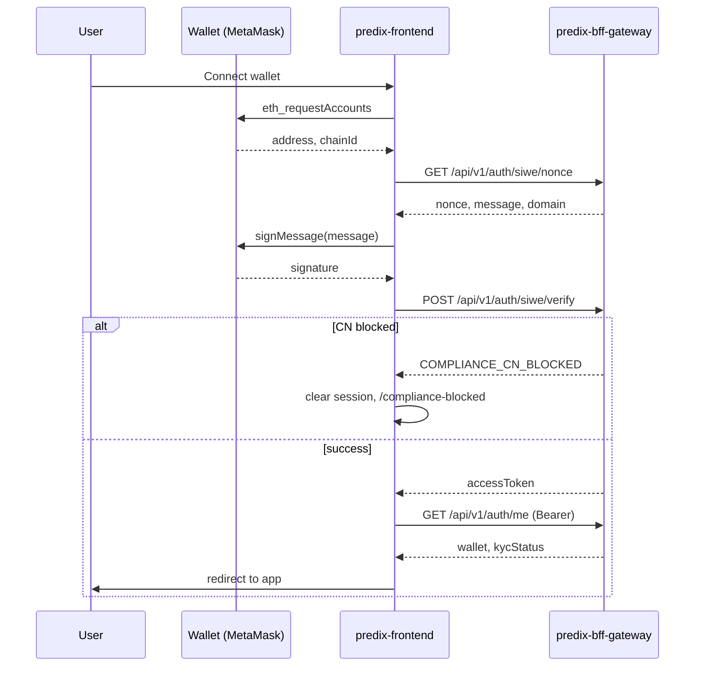

# predix-frontend

PrediX user-facing trading client (Southeast Asia prediction markets). All business logic and chain settlement flow through **predix-bff-gateway** only.

## Prerequisites

- Node.js 20+
- npm 10+
- Running [predix-bff-gateway](https://github.com/predix/predix-bff-gateway) (default `http://localhost:8080`)

## Quick start

```bash
cp .env.example .env.local
npm install
npm run dev
```

Open [http://localhost:3000](http://localhost:3000).

## Environment variables

| Variable | Description |
|----------|-------------|
| `BFF_BASE_URL` | Server-side BFF URL for Next.js rewrite proxy |
| `NEXT_PUBLIC_BFF_BASE_URL` | Browser client base (default `/api/bff`) |
| `NEXT_PUBLIC_SIWE_DOMAIN` | Must match BFF `SIWE_DOMAIN` |
| `NEXT_PUBLIC_SIWE_URI` | SIWE URI field |
| `NEXT_PUBLIC_DEFAULT_CHAIN_ID` | Wallet chain ID (default `1`) |

See [.env.example](.env.example).

## Scripts

| Command | Description |
|---------|-------------|
| `npm run dev` | Development server |
| `npm run build` | Production build |
| `npm run start` | Production server |
| `npm run lint` | ESLint |
| `npm run typecheck` | TypeScript |
| `npm test` | Vitest unit/component tests |
| `npm run test:e2e` | Playwright E2E |

## API configuration

Browser requests go to `/api/bff/*`, proxied to `BFF_BASE_URL` (see `next.config.ts`).

Services:

- `services/authService.ts` — SIWE nonce/verify, me, logout
- `services/marketService.ts` — markets, orderbook, positions
- `services/orderService.ts` — place/cancel orders
- `services/portfolioService.ts` — balances, positions aggregation
- `services/custodyService.ts` — deposit/withdraw placeholders

## SIWE login flow



## Compliance (frontend behavior)

| BFF code | Frontend action |
|----------|-----------------|
| `COMPLIANCE_CN_BLOCKED` | Clear session, redirect `/compliance-blocked`, disable all trading |
| `COMPLIANCE_KYC_REQUIRED` | Allow market browse; disable order form & custody actions; show KYC banner |

Geo detection is performed by BFF (`ComplianceFilter`). Frontend reacts to error codes only.

## Project structure

```
app/                 # App Router pages
components/          # UI components
features/            # Auth providers
hooks/               # React hooks
lib/                 # Utilities
services/            # BFF clients
stores/              # Zustand
types/               # TypeScript types
docs/                # Architecture & flows
__tests__/           # Vitest
e2e/                 # Playwright
```

## Documentation

- [docs/architecture.md](docs/architecture.md)
- [docs/user-flow.md](docs/user-flow.md)
- [docs/error-code-mapping.md](docs/error-code-mapping.md)

## Testing

```bash
npm test
npm run test:e2e   # requires dev server
```

## License

Proprietary — PrediX
